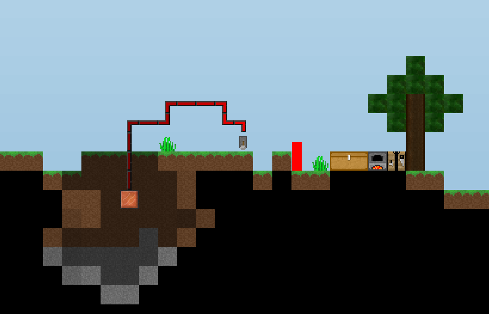

# Craftmine
A Terraria / Minecraft hybrid written in Processing

I initially wrote this as my final project for CGRA151. Since then, I've since worked on it a little to add some new features, such as redstone and a creative mode.

Hopefully some people find this useful, if not only as a demonstration of what Processing can do. Throughout writing this I was amazed at how easy some of the traditionally harder parts were --- Processing has a nice XML parsing system built-in, for example, and that made saving and loading worlds quite easy. I've also heard that networking / sockets work quite well out-of-the-box too, so maybe at some point I'll have a go at making a multiplayer version of this, although I think I would have to do quite a bit of refactoring.

Feel free to hack on your own stuff too. Most of the important parts of the engine have pretty good JavaDoc, and the blocks / items that I have implemented should give a fairly good idea of how to use most features. One nice part about the implementation is that it supports modloading --- add a new tab (or re-use the SimpleMod tab I have as an example) and you can add most things you could imagine (blocks, items, biomes, dimensions, entities, etc, etc) without having to edit any other files.

If you make something cool that you feel fits the theme of the game, feel free to make a pull request and I'd be more than happy to incorporate it.

## Getting Started

Download Processing from https://processing.org/download/, and open this project in it. Select the "Run" button to run the game.

You can play using the following controls:

 * <kbd>W</kbd>, <kbd>A</kbd>, <kbd>S</kbd>, <kbd>D</kbd> to move
 * <kbd>SPACE</kbd> to jump
 * <kbd>E</kbd> to open / close your inventory
 * <kbd>ESC</kbd> to go back to the previous screen

In terms of the mouse, the controls here are slightly different to what you may be used to:
 * <kbd>LEFT</kbd> with a tool breaks blocks on the foreground layer, <kbd>RIGHT</kbd> with a tool breaks blocks on the background layer.
 * <kbd>LEFT</kbd> with a block places on the foreground layer, <kbd>RIGHT</kbd> with a block places on the background layer.
 * Otherwise, <kbd>RIGHT</kbd> uses the current block or item, e.g. opening a crafting table, starting a fire with the flint and steel, etc.

There are also some "secret" controls that are good for debugging:

 * <kbd>P</kbd> renders the FPS in the top-left corner of the screen while held.
 * <kbd>F</kbd> turns on fullbright mode while held, essentially disabling the lighting system.
 * <kbd>C</kbd> toggles between survival and creative mode.
